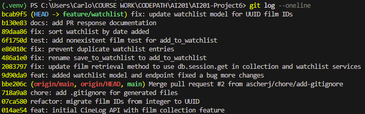

# PR Response Doc — CineLog Watchlist Feature

## AI Usage
- I used AI tools during this project primarily for codebase orientation and review preparation. I used AI to help understand existing CineLog patterns, especially how `add_to_collection()` handled film validation, duplicate prevention, and testing structure before implementing the watchlist changes.

- I also used AI tools for the final commit cleanup, where I used AI to verify that my commit messages followed conventional commit formatting (`feat:`, `fix:`, `test:`, `docs:`) and that each commit represented a logical change.

## Comment 1 — Rename
**What I did:**
- Renamed `save_to_watchlist()` to `add_to_watchlist()` in the watchlist service and updated every import and call site.

**How I verified:**
- Ran the full test suite and confirmed there were no import or runtime errors.

## Comment 2 — Deduplication
**What I did:**
- Implemented a duplicate check before creating a new watchlist entry. The implementation follows the same pattern used by `add_to_collection()` so the behavior is consistent across services.

**How I verified:**
- Confirmed duplicate additions raise the expected exception and that only one database entry exists for a user/film pair.

## Comment 3 — Missing test
**What I did:**
- Created `tests/test_watchlist.py` and added a test that verifies adding a nonexistent film raises `FilmNotFoundError`.

**How I verified:**
- Ran the new watchlist test individually and then executed the complete test suite to ensure nothing else regressed.

## Comment 4 — Default visibility
**My position:**
- I chose to keep `public=True` as the default for watchlist entries.

**Reasoning:**
- CineLog is designed as a community film tracking application where users can discover and share movies with others. A public watchlist supports that goal by making it easy for friends and other people to see what someone plans to watch without requiring additional configuration. Since users who prefer privacy can still explicitly mark entries as private, the default favors the most common social workflow while keeping the option to opt out.

**Tradeoff acknowledged:**
- I understand the concern that some users may expect a watchlist to be private by default, since future viewing plans can be personal. A private default would better protect user privacy and prevent accidental sharing. However, I believe the current default better aligns with CineLog's emphasis on social discovery and reduces friction for users who intend to share their watchlists. If privacy becomes a larger concern, giving users the option of changing their visibility choice would be a better long-term solution than just simply changing the default visibility.

## Comment 5 — Sort order
**My position:**
- I changed the watchlist to sort by `date_added` in descending order (newest first).

**Reasoning:**
- The collection service already returns items in newest-first order, so using the same behavior for the watchlist provides a more consistent experience across CineLog. Users are also more likely to interact with recently added films, making recency a useful default.

**Engagement with reviewer's point:**
- I understand the benefit of alphabetical ordering because it makes long watchlists easier to browse. However, I think consistency with the collection feature and prioritizing recent user activity better supports the primary workflow. If alphabetical browsing becomes important, it could be offered as an optional sort rather than replacing the default.

## Comment 6 — Rebase
**What conflicted:**
- During the rebase of `feature/watchlist` onto `origin/main`, Git reported an add/add conflict in `.gitignore` because both branches had introduced their own versions of the file.

**How I resolved it:**
- I manually reviewed both `.gitignore` versions and combined the required ignore rules for the project, including environment files, Python cache files, database files, and virtual environments. After resolving the conflict, I continued the rebase process and verified that the watchlist feature remained compatible with the UUID-based film IDs introduced on main.

**How I verified no conflict remains:**
- I completed the rebase successfully, checked the commit history with `git log --oneline --graph` to confirm there were no merge commits, and ran `pytest tests/ -v` to verify the application still passed all tests.

**Git Logs:**


## PR Description

---

# Add Watchlist Feature

## Overview

This PR adds a watchlist feature to CineLog that allows users to save films they want to watch later. The feature introduces a new `WatchlistEntry` model, service-layer functions for managing watchlist data, and API endpoints for adding and retrieving watchlist entries.

The implementation follows existing CineLog patterns from the collection feature, including film validation, duplicate prevention, and UUID-based film IDs.

## Changes Made

- Added `WatchlistEntry` model for storing user film watchlist entries
- Added `add_to_watchlist()` service function for saving films
- Added duplicate prevention to prevent users from adding the same film multiple times
- Added `get_watchlist()` functionality for retrieving saved films
- Updated watchlist implementation to use UUID film IDs after the main branch refactor
- Added tests for invalid film IDs when adding films to a watchlist
- Added documentation for review responses and design decisions

## Design Decisions

### Default Visibility

- The watchlist visibility default remains `public=True`.
    - I chose this because CineLog is a community-focused film tracking application where users can discover films through other users' activity. Making watchlists public by default encourages sharing and helps create a more social experience.
    - I acknowledge that private-by-default would provide stronger privacy protection for users who do not want their watchlist activity visible. However, public-by-default better aligns with CineLog's goal of film discovery and community interaction. The visibility field still allows support for private watchlists in the future.

### Sort Order

- The watchlist is sorted by `date_added` in descending order, showing the most recently added films first.
    - I chose this because a watchlist represents a queue of films a user wants to watch. Showing recent additions first allows users to quickly access their latest interests and matches the existing ordering pattern used by the collection feature.
    - While alphabetical sorting could make larger lists easier to browse, I believe chronological ordering better represents the purpose of a watchlist. Alphabetical sorting could be added later as an optional filter or search feature.

## Manual Testing Instructions

1. Install dependencies:

```bash
pip install -r requirements.txt
```

2. Start the application:
```bash
python app.py
```

3. Run the test suite:
```bash
pytest tests/ -v
```

4. Add a film to a user's watchlist:
```bash
POST /watchlist/<user_id>/add
```

- Request body:
    ```bash
    {
    "film_id": "<film_uuid>"
    }
    ```

- Expected result:
    - Returns status code 201
    - Creates a new watchlist entry

5. Retrieve a user's watchlist:
```bash
GET /watchlist/<user_id>
```

- Expected result:

    - Returns the user's saved films
    - Includes watchlist metadata such as date_added and public
    - Test duplicate prevention:

6. Attempt to add the same film twice.

- Expected result:

    - Raises AlreadyInWatchlistError
    - Does not create duplicate watchlist entries
    - Test invalid film handling:

7. Attempt to add a film UUID that does not exist.

- Expected result:
    - Raises FilmNotFoundError

## Summary

This PR adds the foundation for users to manage a personal watchlist while keeping behavior consistent with CineLog's existing collection feature. The implementation addresses all review feedback, including naming consistency, duplicate handling, testing coverage, visibility behavior, sorting decisions, and compatibility with the UUID-based film model.